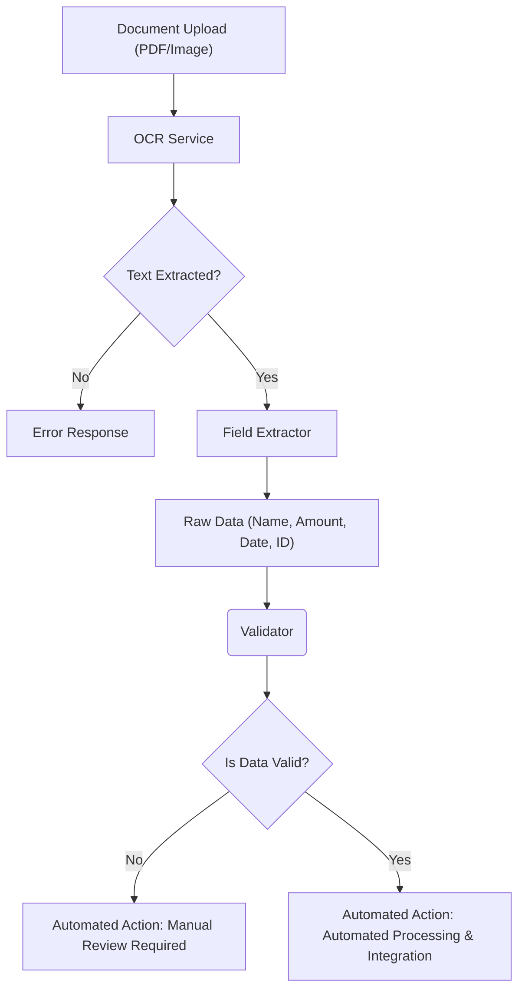

# Automated Document Processing Pipeline Diagram

The following diagram illustrates the flow of data through the system, from user upload to the final automated action.

## Description of Stages
1. **OCR Service**: Utilizes PaddleOCR to extract text from images or PDFs in-memory.
2. **Field Extractor**: Uses Regex patterns to identify Name, Amount, Date, and ID.
3. **Validator**: Checks for data presence, format, and logical ranges.
4. **Action Engine**: Triggers business logic (e.g., Audit flags) based on validated data.
