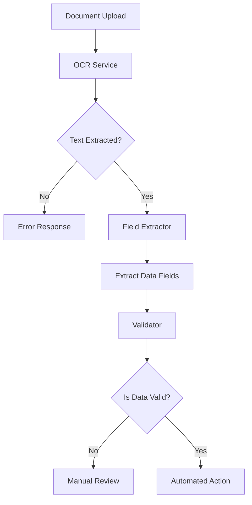

# Automated Document Processing Pipeline

This is a Flask-based OCR (Optical Character Recognition) pipeline that extracts and processes structured data from documents such as invoices, forms, receipts, and more. The pipeline also triggers automated actions based on the extracted information.

---

## Pipeline Overview

1. **Document Upload**: Users upload a document (PDF or image).  
2. **OCR Extraction**: Text is extracted from the document using OCR.  
3. **Data Parsing**: Key fields (e.g., Name, Amount, Date, ID) are identified and validated.  
4. **Action Triggering**: Based on extracted data, automated actions are triggered (e.g., email notifications, manual reviews).  
5. **Response**: Returns structured JSON with the OCR text, extracted fields, validation results, and any actions triggered.  

### Processing Flow



---

## Validation Rules

| Field | Rule Type | Description |
| :--- | :--- | :--- |
| **Name** | Presence | Must be extracted from the document. |
| | Format | Must contain only alphabetic characters and spaces. |
| **Amount** | Presence | Must be extracted from the document. |
| | Format | Must be a valid numeric value. |
| | Range | Must be greater than zero. |
| **Date** | Presence | Must be extracted from the document. |
| | Format | Follows standard date formats (DD/MM/YYYY, etc). |
| **ID** | Presence | Must be extracted from the document. |
| | Format | Alphanumeric invoice or ID number. |

---

## API Endpoints

### 1. Process Document
**POST** `/process-document`  

- **Payload**: `form-data`  
- **Key**: `file` (Image or PDF)  
- **Returns**: JSON containing:
  - `ocr_text` – raw OCR output  
  - `data` – structured key-value pairs (Name, Amount, Date, ID)  
  - `validation` – validation results for extracted fields  
  - `action` – description of any automated actions executed  

#### Example Request (cURL)
```bash
curl -X POST "https://vamsi1103-ocr.hf.space/process-document" \
  -F "file=@invoice.pdf"
```
document link:https://drive.google.com/file/d/1AyMhvBodgUVtYs6c3IkI8b9FY1P9QtV8/view?usp=sharing
#### Example Response
```json
{
    "action": "Action: Automated Processing & Integration Triggered",
    "data": {
        "amount": "1500",
        "date": "2026-03-15",
        "id": "inv12345",
        "name": "john doe date"
    },
    "ocr_text": "invoice #1 name: john doe date: 2026-03-15 amount: 1500 id: inv12345 invoice#2 name: alice smith amount: 2000 date: 2026-03-16 id: inv12346 invoice#3 name: bob amount: -500 date: 2026-03-17 id: inv12347 invoice #4 name: amount: 1800 date: 2026-03-18 id: inv12348 invoice #5 name: charlie brown amount: 2200 date: 2026-15-19 id: inv12349 invoice #6 name: david lee amount: 2500 date: 2026-03-20 id: invoice#7 name: eva green amount: 3000 date: 2026-03-21 id: inv12351 invoice#8 name: frank hall amount: 1200 date: 2026-03-22 id: inv12352",
    "status": "success",
    "validation": {
        "errors": [],
        "is_valid": true
    }
}
```

---

## Deployment Information

* **Deployed on Hugging Face Spaces**: [https://vamsi1103-ocr.hf.space](https://vamsi1103-ocr.hf.space)
* **Source Repository**: [https://huggingface.co/spaces/vamsi1103/ocr](https://huggingface.co/spaces/vamsi1103/ocr)
* **Dockerized**: Highly portable containerized environment.
* **Port**: 7860

---

## Supported Document Types

* PDF documents
* Image formats: PNG, JPG, JPEG
